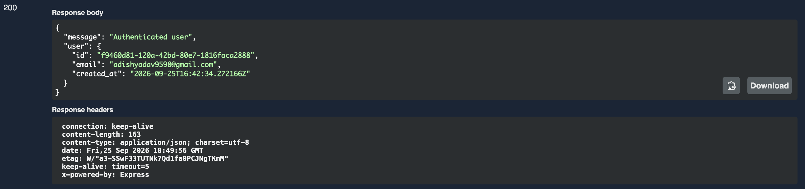

# Task CRUD API

A RESTful CRUD API built with Node.js, Express, PostgreSQL, Supabase Authentication, Docker, and Swagger/OpenAPI.

## Features

- Create, read, update, and delete tasks
- PostgreSQL database with persistent storage
- Docker and Docker Compose support
- Supabase email/password authentication
- JWT-based protected routes
- Reusable authentication middleware
- Public and protected API routes
- Secure logout endpoint
- Input validation
- Parameterized SQL queries
- Proper HTTP status codes
- Swagger UI documentation
- Swagger Bearer authentication
- Automatic database and table creation
- Example tasks seeded automatically when the table is empty

## Tech Stack

- Node.js
- Express.js
- PostgreSQL
- Supabase Auth
- Docker
- Docker Compose
- node-postgres (`pg`)
- Swagger UI
- OpenAPI 3.0

## Project Structure

```text
task-crud-api/
├── server.js
├── openapi.json
├── package.json
├── package-lock.json
├── Dockerfile
├── compose.yaml
├── .env.example
├── .gitignore
└── screenshots/
    └── swagger-auth.png
```

## Environment Setup

Create a `.env` file in the project root:

```env
POSTGRES_USER=postgres
POSTGRES_PASSWORD=your_postgres_password
POSTGRES_DB=tasks
DATABASE_URL=postgres://postgres:your_postgres_password@db:5432/tasks

SUPABASE_URL=https://your-project.supabase.co
SUPABASE_KEY=your_supabase_publishable_key

PORT=3000
```

Never commit the real `.env` file or real Supabase credentials.

## Run the Application

Make sure Docker Desktop is running.

Start the complete API and PostgreSQL stack with:

```bash
docker compose up -d --build
```

The API will be available at:

```text
http://localhost:3000
```

Health check:

```text
http://localhost:3000/health
```

Swagger documentation:

```text
http://localhost:3000/docs
```

## Authentication API

| Method | Endpoint | Authentication |
|---|---|---|
| POST | `/auth/signup` | Public |
| POST | `/auth/login` | Public |
| POST | `/auth/logout` | Bearer JWT |
| GET | `/protected/profile` | Bearer JWT |
| GET | `/protected/dashboard` | Bearer JWT |
| GET | `/public/info` | Public |

## Task API

| Method | Endpoint | Description |
|---|---|---|
| GET | `/tasks` | Get all tasks |
| POST | `/tasks` | Create a task |
| GET | `/tasks/:id` | Get a task |
| PUT | `/tasks/:id` | Update a task |
| DELETE | `/tasks/:id` | Delete a task |

## Swagger UI

The API includes interactive Swagger/OpenAPI documentation.

Open:

```text
http://localhost:3000/docs
```

Protected endpoints use Bearer JWT authentication through the Swagger **Authorize** button.

### Swagger Authentication

1. Login using `POST /auth/login`.
2. Copy the returned `access_token`.
3. Click **Authorize** in Swagger UI.
4. Enter the access token.
5. Execute a protected endpoint such as `/protected/profile`.

Successful authentication returns the authenticated user's information.



## Security

- Supabase handles user authentication.
- Passwords are not stored directly by this API.
- Supabase publishable credentials are loaded through environment variables.
- `.env` is excluded from Git.
- Protected routes verify the Supabase access token.
- Invalid or expired tokens return `401 Unauthorized`.

## Database

PostgreSQL runs as a Docker Compose service.

The API connects to PostgreSQL using the `DATABASE_URL` environment variable.

The database volume allows data to persist across container restarts.

## GitHub

This project is published on GitHub:

https://github.com/SHARWANYADAV12/task-crud-api