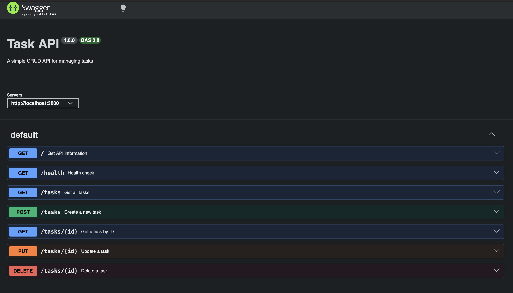

# Task API

A simple CRUD API for managing a to-do list using Node.js and Express.

## Features

- Create tasks
- Read all tasks
- Read a task by ID
- Update tasks
- Delete tasks
- Input validation
- Proper HTTP status codes
- Swagger UI documentation

## Tech Stack

- Node.js
- Express.js
- Swagger UI
- OpenAPI 3.0
- Git & GitHub

## Installation

    npm install

## Run the Server

    node server.js

The server will start at:

    http://localhost:3000

## API Endpoints

| Method | Endpoint | Description |
|--------|----------|-------------|
| GET | / | Get API information |
| GET | /health | Check API health |
| GET | /tasks | Get all tasks |
| GET | /tasks/:id | Get a task by ID |
| POST | /tasks | Create a new task |
| PUT | /tasks/:id | Update a task |
| DELETE | /tasks/:id | Delete a task |

## Example Requests

### Create a Task

    curl -i -X POST http://localhost:3000/tasks \
    -H "Content-Type: application/json" \
    -d '{"title":"Learn Express"}'

Example response:

    HTTP/1.1 201 Created
    Content-Type: application/json

    {"id":4,"title":"Learn Express","done":false}

### Get All Tasks

    curl -i http://localhost:3000/tasks

### Get Task by ID

    curl -i http://localhost:3000/tasks/1

### Update a Task

    curl -i -X PUT http://localhost:3000/tasks/1 \
    -H "Content-Type: application/json" \
    -d '{"title":"Learn Node.js","done":true}'

### Delete a Task

    curl -i -X DELETE http://localhost:3000/tasks/3

## HTTP Status Codes

| Status Code | Meaning |
|-------------|---------|
| 200 | Request successful |
| 201 | Task created successfully |
| 204 | Task deleted successfully |
| 400 | Invalid request data |
| 404 | Task not found |

## Swagger UI

Swagger documentation is available at:

    http://localhost:3000/docs

The Swagger UI allows testing all CRUD endpoints using the "Try it out" feature.

## Project Structure

    task-crud-api/
    ├── server.js
    ├── openapi.json
    ├── package.json
    ├── package-lock.json
    ├── README.md
    ├── screenshots/
    │   └── swagger.png
    └── .gitignore

## Data Storage

Tasks are stored in an in-memory JavaScript array.

No database or external storage is used.

## Git

This project was developed in stages with meaningful Git commits for each stage.

- Stage 0: Hello server
- Stage 1: Root and health endpoints
- Stage 2: Read endpoints with 404
- Stage 3: Create with validation
- Stage 4: Full CRUD
- Stage 5: Swagger UI

## Author

Sharwan Yadav